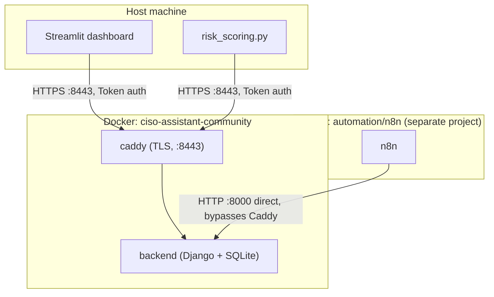

# VIGCAP — Veridian Identity Governance & Continuous Assurance Program

> **This is a synthetic portfolio project.** Veridian LegalTech does not exist. Every employee, vendor, system, dataset, and finding in this repository is fabricated for the purpose of demonstrating GRC/identity-governance engineering work — no real organization, person, or incident is represented. Nothing here is real audit or client experience.

A GRC and identity-governance program built end-to-end for a fictional B2B SaaS company: a risk register and control catalog scored against a documented methodology, loaded into a real self-hosted GRC platform via its REST API, tested against SOC 2 CC6, automated with n8n, and surfaced in a custom-built Streamlit executive dashboard. Complements [`aegis-triage`](https://github.com/mikeperrella/aegis-triage) (agentic SOC alert triage) by occupying distinct territory — governance and compliance judgment, not agentic threat response.

## Architecture



This is the system **as actually built**, verified against `docker ps` and the real compose files — not the original plan. Full diagram, every real deviation from that plan (two separate Docker Compose projects, the two different execution contexts hitting the same API, an n8n node-namespace quirk, and a stack correction found while writing this), in **[`docs/architecture.md`](docs/architecture.md)**.

## What's real here, as of 2026-08-27

Every number below was recomputed fresh from this repo's own files or a live API call while writing this stage — not recalled from an earlier report. Several are inherently time-dependent (findings age, reviews go stale); the date is the point.

| | |
|---|---|
| Risk register | 16 risks — 1 Critical / 3 High / 12 Medium inherent; residual (live, CISO Assistant): 2 High / 9 Medium / 5 Low — the CSV's own combined-score band differs for 6 of 16 risks, see `docs/decision-log.md` #18; avg. control effectiveness 25% |
| Control catalog | 10 controls — 8 Partially Implemented, 2 Designed (not yet implemented) |
| Control testing | 12 SOC 2 points of focus actually tested (of 375 in the full imported framework): 6 non-compliant, 6 partially compliant, 0 fully compliant |
| Findings | 4 findings — 1 closed (full identify→remediate→verify→monitor lifecycle), 3 open, 0 overdue |
| Identity inventory | 195 synthetic employees; 45 privileged/admin accounts, 31 stale on review (blank or >90 days) |
| Assets | 15 imported — 7 Primary / 8 Support |
| Automation | n8n UAR workflow (7 nodes): auto-attested 29/45 privileged accounts, correctly escalated 2 exceptions requiring manual review |
| Dashboard | 1,105 lines of Python across 6 files, pulling live from the platform's API where the API has the data, local CSVs where it doesn't (documented per-metric in `docs/stage6-dashboard-notes.md`) |
| Build | 28 commits on `main`, 7 build stages, ~25 individually-documented corrections/decisions (`docs/decision-log.md`) |

Sample evidence artifacts — a live finding export, the identity-inventory rows cited as its evidence, and a dashboard screenshot — are in **[`evidence/`](evidence/)**.

## Tech stack

| Component | Tool | Notes |
|---|---|---|
| GRC system of record | [CISO Assistant](https://github.com/intuitem/ciso-assistant-community) Community Edition (Docker) | AGPL v3, API-first, self-hosted |
| Automation | [n8n](https://n8n.io) (self-hosted, Docker) | `n8n-nodes-ciso-assistant` community node |
| Dashboard | Python + Streamlit, native theming + hand-rolled CSS | No component library — see `docs/decision-log.md` #16-17 |
| Risk scoring | Python (`scripts/risk_scoring.py`) | Deterministic — re-verified byte-identical across repeated runs this session |
| Data | Synthetic CSV, generated by `data/generate_inventory.py` | |
| Diagrams | Mermaid | Renders natively on GitHub |

Full justification for every tool choice — including two rejected alternatives (Eramba, `streamlit-facade`) and why — is in `CLAUDE.md` and `docs/decision-log.md`.

## Running it locally

Requires Docker Desktop, Python 3.11+, and `pip install -r requirements.txt`.

```bash
# 1. Generate the synthetic dataset
python data/generate_inventory.py

# 2. Run CISO Assistant (sibling checkout, not part of this repo)
cd ../ciso-assistant-community && docker compose up -d

# 3. Run the n8n automation stack
cd automation/n8n && docker compose up -d --build

# 4. Recalculate residual risk against the live platform
CISO_ASSISTANT_PAT=<your PAT> python scripts/risk_scoring.py

# 5. Run the dashboard
CISO_ASSISTANT_PAT=<your PAT> streamlit run dashboard/app.py
```

Generating a PAT: CISO Assistant UI → Settings → Personal Access Tokens.

## Documentation

| Doc | What's in it |
|---|---|
| [`docs/company-profile.md`](docs/company-profile.md) | The fictional company scenario |
| [`docs/risk-methodology.md`](docs/risk-methodology.md) | The scoring model, in plain language |
| [`docs/soc2-cc6-nist-csf-mapping.md`](docs/soc2-cc6-nist-csf-mapping.md) | Why SOC 2 CC6 is primary, NIST CSF secondary, and where they overlap |
| [`docs/stage3-deployment-notes.md`](docs/stage3-deployment-notes.md) | CISO Assistant deployment + data population, verified |
| [`docs/stage4-control-testing-findings.md`](docs/stage4-control-testing-findings.md) | All 10 control tests, all 4 findings, the one full lifecycle |
| [`docs/stage5-automation-notes.md`](docs/stage5-automation-notes.md) | n8n workflow + risk-scoring script, verified end to end |
| [`docs/stage6-dashboard-notes.md`](docs/stage6-dashboard-notes.md) | Dashboard build, every bug found and fixed along the way |
| [`docs/architecture.md`](docs/architecture.md) | The system as actually built, with every real deviation from the plan |
| [`docs/decision-log.md`](docs/decision-log.md) | Every correction and decision across the whole build, indexed |
| [`docs/credibility-audit.md`](docs/credibility-audit.md) | The project's own final self-audit, answered explicitly |

## License

MIT — see [`LICENSE`](LICENSE).

---

**Reminder:** Veridian LegalTech is fictional. This repository demonstrates GRC engineering and identity-governance judgment against a synthetic scenario — it is not a record of real audit work, and no data here describes a real company or person.
