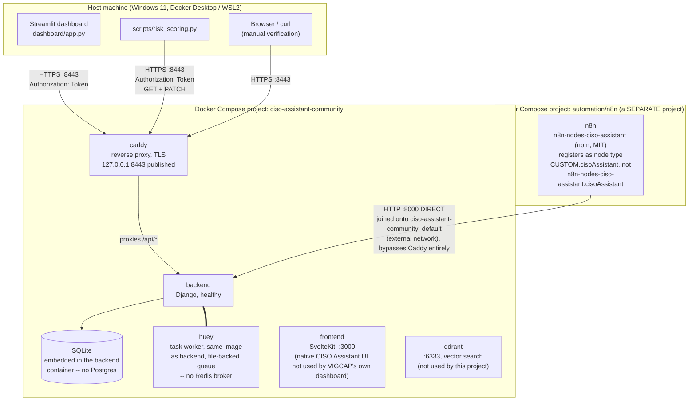

# Architecture — As Actually Built

> **Synthetic data.** Veridian LegalTech is fictional. See the root [README.md](../README.md) for the full disclaimer.

This diagrams the system as it exists today, verified against `docker ps`, the real `docker-compose.yml` files, and `git log` — not CLAUDE.md Section 2's original plan. Three things changed between the plan and the build, all already documented individually across the `docs/stage*-notes.md` files and indexed in `docs/decision-log.md`; this page is where they're shown together as one picture.

## System diagram

## The three real deviations from the original plan

**1. Two separate Docker Compose projects, joined onto one network, not one stack.** CLAUDE.md Section 2 pictured a single pipeline. In practice, CISO Assistant (`ciso-assistant-community`) and n8n (`automation/n8n` in this repo) are two independent `docker compose` projects. n8n's own `docker-compose.yml` attaches its container to `ciso-assistant-community_default` as an `external: true` network *in addition to* its own default network — that's how it reaches the other project's containers at all. See `docs/stage5-automation-notes.md`, "Reaching CISO Assistant from n8n's container."

**2. Two different execution contexts hit the same API two different ways.** `scripts/risk_scoring.py` and the Streamlit dashboard both run on the *host*, outside any container, so they reach CISO Assistant the only way a host process can: through Caddy's published port at `https://localhost:8443`, with the self-signed cert verification disabled. n8n runs *inside* the joined Docker network, so it reaches the Django backend directly at `http://backend:8000`, skipping Caddy and TLS entirely — a plain HTTP call that never leaves the Docker network. These are not interchangeable: Stage 5 documents `risk_scoring.py`'s `--base-url` default being mistakenly copied from the n8n networking fix (`http://backend:8000`), which only resolves inside the Docker network — caught and corrected back to `https://localhost:8443` before that script could actually be used from the host.

**3. The community n8n node's registered type is namespaced differently than its package name.** `n8n-nodes-ciso-assistant` is loaded via `N8N_CUSTOM_EXTENSIONS` rather than a normal marketplace install, which re-namespaces every node it provides under a `CUSTOM.` prefix at runtime — so the workflow JSON's node `type` fields read `"CUSTOM.cisoAssistant"`, not `"n8n-nodes-ciso-assistant.cisoAssistant"`. Confirmed via `n8n export:nodes` (910 → 912 node types after enabling the extension). See `docs/stage5-automation-notes.md`.

## Correction found while writing this diagram

CLAUDE.md Section 3 states the platform's stack as "Django/SvelteKit/PostgreSQL/Redis." The actual `docker-compose.yml` in the sibling `ciso-assistant-community` checkout defines exactly six services — `backend`, `huey`, `frontend`, `qdrant`, `mcp` (defined, not running), `caddy` — confirmed via `docker ps -a` (only six containers exist, ever) and by grepping the compose file for `DATABASE`/`POSTGRES`/`REDIS`/`BROKER` (zero matches, and no `.env` file in that directory either). There is no separate Postgres or Redis container anywhere in this deployment; it runs entirely on the backend image's baked-in SQLite database and a file-backed `huey` queue. Corrected in CLAUDE.md Section 3 and indexed in `docs/decision-log.md`.

## What's in each box, concretely

| Component | Role in this project | Not used for |
|---|---|---|
| `caddy` | TLS termination + reverse proxy for all host-side API traffic | — |
| `backend` | Django app: REST API, all CRUD for risks/controls/findings/frameworks | — |
| `huey` | Background task worker (report generation, etc.), bundled with CISO Assistant | Not part of this project's own automation — that's n8n |
| `frontend` | CISO Assistant's own SvelteKit UI, used for manual verification during Stages 3-4 | The portfolio-facing executive view, which is the Streamlit dashboard instead — see CLAUDE.md Section 2, "Why a separate Streamlit dashboard" |
| `qdrant` | Ships with CISO Assistant for its AI/vector-search features | Not exercised by this project |
| `n8n` | Runs the UAR-automation workflow (`automation/n8n/uar-workflow.json`) against the live API | — |
| `dashboard/` | Reads live from the API (+ local CSVs where the API has no equivalent field) | Never writes — read-only by design, see `dashboard/api_client.py` |
| `scripts/risk_scoring.py` | The one component that writes back to CISO Assistant (`PATCH` residual risk indices) | — |
